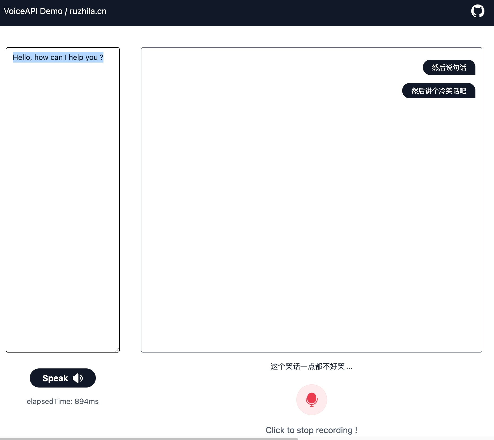

# voiceapi - a streaming voice transcription/synthesis API with sherpa-onnx

## How to use
Thanks to [k2-fsa/sherpa-onnx](https://github.com/k2-fsa/sherpa-onnx), we can easily build a voice API with Python.


## Run the app (only tested on Linux/MacOS with CPU)
```shell
python3 -m venv venv
. venv/bin/activate

pip install -r requirements.txt
python app.py
```
## TTS Generate (non streaming)
- `samplerate` can be set in the query string, default is 16000.
- `sid` is the Speaker ID, default is 0.
- `text` is the speed of the synthesized audio, default is 1.0.
```shell
curl -X POST "http://localhost:8000/tts" \
     -H "Content-Type: application/json" \
     -d '{
           "text": "Hello, world!",
           "sid": 0,
           "samplerate": 16000
         }' -o helloworkd.wav
```
## Streaming API (Via Websocket)
### /asr 
Send PCM 16bit audio data to the server, and the server will return the transcription result.
- `samplerate` can be set in the query string, default is 16000. 
```javascript
    const ws = new WebSocket('ws://localhost:8000/asr?samplerate=16000');
    ws.onopen = () => {
        console.log('connected');
        ws.send('{"sid": 0}');
    };
    ws.onmessage = (e) => {
        const data = JSON.parse(e.data);
        const { text, finished, idx } = data;
        // do something with text
        // finished is true when the segment is finished
    };
    // send audio data
    // PCM 16bit, with samplerate
    ws.send(int16Array.buffer);
```
### /tts
Send text to the server, and the server will return the synthesized audio data.
- `samplerate` can be set in the query string, default is 16000. 
- `sid` is the Speaker ID, default is 0.
- `speed` is the speed of the synthesized audio, default is 1.0.
- `chunk_size` is the size of the audio chunk, default is 1024. 

```javascript
    const ws = new WebSocket('ws://localhost:8000/tts?samplerate=16000');
    ws.onopen = () => {
        console.log('connected');
        ws.send('Your text here');
    };
    ws.onmessage = (e) => {
        if (e.data instanceof Blob) {
            // Chunked audio data
            e.data.arrayBuffer().then((arrayBuffer) => {
                const int16Array = new Int16Array(arrayBuffer);
                let float32Array = new Float32Array(int16Array.length);
                for (let i = 0; i < int16Array.length; i++) {
                    float32Array[i] = int16Array[i] / 32768.;
                }
                playNode.port.postMessage({ message: 'audioData', audioData: float32Array });
            });
        } else {
            // The server will return the synthesized result
            const {elapsed, progress, duration, size } = JSON.parse(e.data);
            this.elapsedTime = elapsed;
        }
    };
```

## Download models
All models are stored in the `models` directory
Only download the models you need. default models are:
- asr models: `sherpa-onnx-streaming-zipformer-bilingual-zh-en-2023-02-20`(Bilingual, Chinese + English)
- tts models: `vits-melo-tts-zh_en` (Chinese + English)


### vits-melo-tts-zh_en
```bash
curl -SL -O https://github.com/k2-fsa/sherpa-onnx/releases/download/tts-models/vits-melo-tts-zh_en.tar.bz2
```
### sherpa-onnx-streaming-zipformer-bilingual-zh-en-2023-02-20
```bash 
curl -SL -O https://github.com/k2-fsa/sherpa-onnx/releases/download/asr-models/sherpa-onnx-streaming-zipformer-bilingual-zh-en-2023-02-20.tar.bz2
```

### silero_vad.onnx
```bash
curl -SL -O https://github.com/snakers4/silero-vad/raw/master/src/silero_vad/data/silero_vad.onnx
```
### sherpa-onnx-paraformer-trilingual-zh-cantonese-en
```bash
curl -SL -O https://github.com/k2-fsa/sherpa-onnx/releases/download/asr-models/sherpa-onnx-paraformer-trilingual-zh-cantonese-en.tar.bz2
```
### whisper
```bash
curl -SL -O https://github.com/k2-fsa/sherpa-onnx/releases/download/asr-models/sherpa-onnx-whisper-tiny.en.tar.bz2
```
### sensevoice
```bash
curl -SL -O https://github.com/k2-fsa/sherpa-onnx/releases/download/asr-models/sherpa-onnx-sense-voice-zh-en-ja-ko-yue-2024-07-17.tar.bz2
```

### sherpa-onnx-streaming-paraformer-bilingual-zh-en
```bash
curl -SL -O  https://github.com/k2-fsa/sherpa-onnx/releases/download/asr-models/sherpa-onnx-streaming-paraformer-bilingual-zh-en.tar.bz2
```
